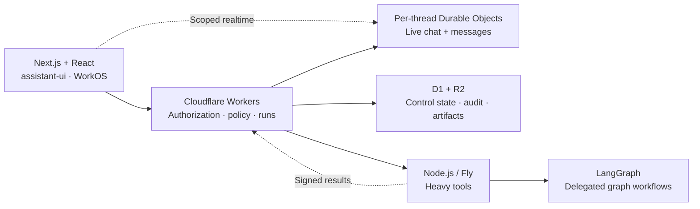
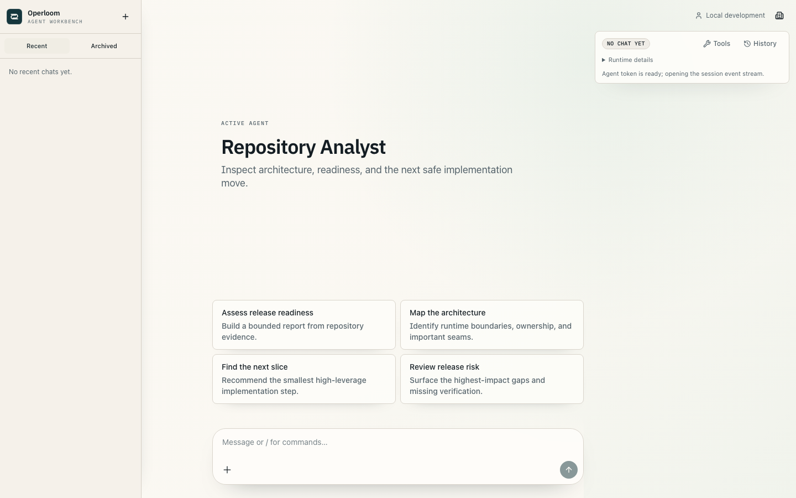

<div align="center">

# Operloom

**Scalable agent systems. Your workflows. Your code.**

A TypeScript workbench built for agents that grow beyond a chat window:
independent conversation runtimes, durable workflows, controlled actions,
and an architecture you can extend into your own product.

[](https://github.com/dawi369/operloom/actions/workflows/verify.yml)
[](#status)
[](#built-for-scale-and-extension)
[](#license)

[Get started](#run-it-locally) · [Build an agent](docs/first-agent.md) · [Architecture](docs/architecture.md) · [Documentation](docs/README.md)

</div>

## Built for scale and extension

Operloom separates live conversations, durable control state, and heavy execution.
Each conversation gets its own Cloudflare Durable Object; process-heavy tools run
in a separate Node.js service. That gives chat and tool execution distinct scaling
boundaries, while workspace permissions and policy stay under server control.

- **Scale conversations independently.** Per-thread runtimes own live messages;
  Cloudflare Workers handle authorization and coordination.
- **Keep work moving beyond a chat turn.** Durable workflows, scheduled/webhook
  triggers, cancellation, retries, and recovery keep execution inspectable.
- **Build whole systems in code.** Typed agent packs contribute tools, workflows,
  managed state, and artifact views. A compiler connects them to the runtime.
- **Give agents authority deliberately.** Approvals, credential brokerage,
  kill switches, and an action ledger govern external side effects.
- **Make the product your own.** Replace agent behavior, integrations, or the
  frontend through shared TypeScript contracts and a framework-neutral client.

The architecture gives you room to build personal assistants, internal operations
tools, research systems, and domain-specific automation on the same foundations.



| Architecture decision                       | What it enables                                                                                                   |
| ------------------------------------------- | ----------------------------------------------------------------------------------------------------------------- |
| **Keep ordinary chat on Cloudflare.**       | Conversations avoid the heavy-tool runtime; hot messages live in per-thread Durable Object SQLite.                |
| **Separate control records and artifacts.** | D1 owns authorization, run state, and audit; R2 holds larger outputs and exports.                                 |
| **Delegate heavy work explicitly.**         | Signed Node.js execution supports process-based tools; LangGraph handles workflows that need graph orchestration. |
| **Enforce policy outside the model.**       | The server resolves tenant scope, credentials, approvals, and mutation permissions.                               |
| **Compile trusted agent packs.**            | Extensions have inspectable, typed contracts without domain-specific logic spreading through the core UI.         |

**Stack:** Next.js 16, React 19, TypeScript, assistant-ui, Tailwind CSS 4,
Cloudflare Agents/Workers/Durable Objects/D1/R2, LangGraph, WorkOS, OpenRouter,
and Sentry. [Architecture, boundaries, and tradeoffs →](docs/architecture.md)



_An isolated local workspace with synthetic data._

## Run it locally

Use **Node.js 24 LTS**, **pnpm 10.33.0**, and an **OpenRouter API key**.
Node 26 is also supported. The repository example uses `ripgrep`; allow about
10 GiB of available RAM for the full local stack and browser.

```bash
git clone https://github.com/dawi369/operloom.git
cd operloom
pnpm install --frozen-lockfile
pnpm operloom init
```

Add `OPENROUTER_API_KEY` to the generated `.env.local` and
`cloudflare/control-plane/.dev.vars`, then start:

```bash
pnpm operloom doctor --offline
pnpm operloom dev
```

Open **[localhost:3000](http://localhost:3000)**. Initialization preserves existing
credentials and data; hosted accounts are not required for the local workspace.
[Setup and resource limits →](docs/getting-started.md)

## Build your own agent

```bash
pnpm operloom pack create --id my-agent --name "My Agent"
pnpm install
pnpm operloom pack compile
pnpm operloom pack check --pack my-agent
```

The scaffold registers your pack in `workbench.config.ts`. Own its behavior and
capabilities in `index.ts` and `prompt.xml`, execution in `control-plane.ts` and
`runner.ts`, and presentation in `web.ts`. Packs are trusted build-time code;
permissions and credentials remain server-controlled.

Start with **Operloom**, the general assistant. **Repository Analyst** adds a
readiness workflow; **Polymancer · Example** demonstrates read-only research.
**Swordfish · Preview** is parked, and **Complex Operator** is a conformance fixture.

[First-agent walkthrough →](docs/first-agent.md) · [Extension contract →](docs/agent-runtime-kit.md)

## Adapt and deploy

```bash
pnpm operloom fork init --id my-system --name "My System" --origin https://agents.example.com
pnpm operloom fork --check
```

The default topology is **Vercel + Cloudflare + Fly**. Supply your own resources
and secrets. Heavy-tool compute can stop when idle; schedules, retained data,
connections, and mutations have explicit deployment gates.

[Deployment guide →](docs/environment-separation.md) · [Forking and upgrades →](docs/forking.md)

## Why I built this

I wanted a home for agent experiments that could become systems I actually trust.
Operloom reflects how I like to build: clear ownership, authority outside the model,
and enough visibility to understand what happened when something fails.

— [David](https://github.com/dawi369)

## Status

Operloom `0.5.1` is a **pre-1.0 developer workbench**, focused on the web app and
extension contracts. [Release readiness](docs/release-readiness.md) tracks the
verification and hosted acceptance evidence.

**Mobile is WIP / future work**, preserved on
[`codex/mobile-wip`](https://github.com/dawi369/operloom/tree/codex/mobile-wip).

[Contributing](CONTRIBUTING.md) · [Security](SECURITY.md) · [Release notes](docs/operloom-release.md)

## License

**Source-available under [PolyForm Noncommercial 1.0.0](LICENSE).**
Commercial use requires a [separate agreement](COMMERCIAL_USE.md).
This is not an OSI-approved open-source license.

Built on the assistant-ui LangGraph starter, with gratitude to its maintainers.
