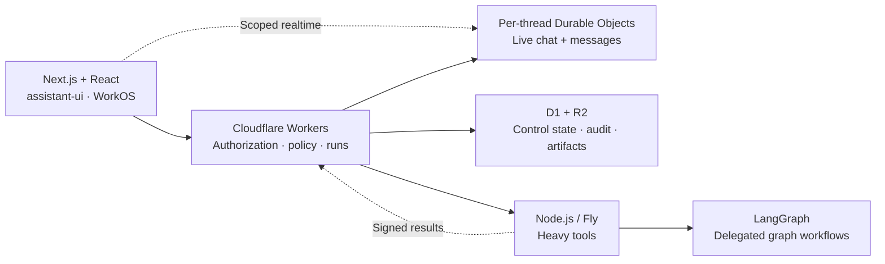

<div align="center">

# Operloom

**Scalable agent systems. Your workflows. Your code.**

A TypeScript workbench built for agents that grow beyond a chat window:
independent conversation runtimes, durable workflows, controlled actions,
and an architecture you can extend into your own product.

[](https://github.com/dawi369/operloom/actions/workflows/verify.yml)
[](#status)
[](#built-for-scale-and-extension)
[](#license)

[Get started](#run-it-locally) · [Build an agent](docs/first-agent.md) · [Architecture](docs/architecture.md) · [Documentation](docs/README.md)

</div>

## Built for scale and extension



- **Separate chat from heavy execution.** Each conversation has its own Durable
  Object; process-based tools run in Node.js. Chat and tool execution can scale
  independently, and the runner can stop when idle.
- **Keep authority outside the model.** The control plane owns authorization,
  policy, and run state in D1; R2 holds artifacts. Tools receive scoped execution
  context rather than deciding their own permissions.
- **Compile extensions into the system.** Trusted TypeScript packs register
  tools, workflows, state, and views through versioned contracts. Domain behavior
  stays in the pack instead of spreading through the core UI.

**Stack:** Next.js 16, React 19, TypeScript, assistant-ui, Tailwind CSS 4,
Cloudflare Agents/Workers/Durable Objects/D1/R2, LangGraph, WorkOS, OpenRouter,
and Sentry. [Architecture, boundaries, and tradeoffs →](docs/architecture.md)


_An isolated local workspace with synthetic data._

## Run it locally

Use **Node.js 24 LTS**, **pnpm 10.33.0**, and an **OpenRouter API key**.
Node 26 is also supported. The repository example uses `ripgrep`; allow about
10 GiB of available RAM for the full local stack and browser.

```bash
git clone --branch v1.0.0 https://github.com/dawi369/operloom.git
cd operloom
pnpm install --frozen-lockfile
pnpm operloom init
```

Add `OPENROUTER_API_KEY` to the generated `.env.local` and
`cloudflare/control-plane/.dev.vars`, then start:

```bash
pnpm operloom doctor --offline
pnpm operloom dev
```

Open **[localhost:3000](http://localhost:3000)**. Initialization preserves existing
credentials and data; hosted accounts are not required for the local workspace.
Use `/agents` to choose Operloom. To try a repository report, open `/admin` →
**Agents** → **Repository Analyst** → **Use agent**, then **Assess release readiness**.
[Setup and resource limits →](docs/getting-started.md)

## Build your own agent

```bash
pnpm operloom pack create --id my-agent --name "My Agent"
pnpm install
pnpm operloom pack compile
pnpm operloom pack check --pack my-agent
```

The scaffold registers your pack in `workbench.config.ts`. Own its behavior and
capabilities in `index.ts` and `prompt.xml`, execution in `control-plane.ts` and
`runner.ts`, and presentation in `web.ts`. Packs are trusted build-time code;
permissions and credentials remain server-controlled.

Here is part of [Repository Analyst's workflow](agent-packs/repo-analyst/control-plane.ts):
call its read-only snapshot tool, derive a report, and persist it through scoped
managed state. This is an excerpt from the workflow body, not a complete pack.

```ts
const snapshot = await context.tools.invoke("repo.snapshot", input);
if (!snapshot.ok) return snapshot;

const report = buildReadinessReport(snapshot.output as RepoSnapshotOutput);
const artifactId = `${context.run.id}-repo_readiness_report`;
await context.managedState.upsert({
  namespace: "repo-monitor",
  stateType: "repository-readiness",
  stateKey: "current",
  status: report.status,
  summary: report.summary,
  data: {
    report,
    runId: context.run.id,
    workflowIntentId: context.run.workflowIntentId,
    artifactRefs: [artifactId],
  },
});
```

The rest of the workflow returns the report as an artifact. The pack owns the
report logic; the runtime supplies tool dispatch, tenant scope, and run history.

Start with **Operloom**, the general assistant. **Repository Analyst** adds a
readiness workflow; **Polymancer · Example** demonstrates read-only research.
**Swordfish · Preview** is parked, and **Complex Operator** is a conformance fixture.

[First-agent walkthrough →](docs/first-agent.md) · [Extension contract →](docs/agent-runtime-kit.md)

## Adapt and deploy

```bash
pnpm operloom fork init --id my-system --name "My System" --origin https://agents.example.com
pnpm operloom fork --check
```

The default topology is **Vercel + Cloudflare + Fly**. Supply your own resources
and secrets. Heavy-tool compute can stop when idle; schedules, retained data,
connections, and mutations have explicit deployment gates.

[Deployment guide →](docs/environment-separation.md) · [Forking and upgrades →](docs/forking.md)

## Engineering notes

A repository scan took milliseconds, but its workflow failed after 30 seconds:
starting the stopped runner consumed most of the budget. The fix kept the runner
able to stop when idle and preserved existing agent snapshots.
[Cold starts, deadlines, and the 1.0 fix →](docs/case-studies/cold-start-deadline.md)

## Status

Operloom `1.0.0` stabilizes the **web developer workbench**: chat, agent packs,
read-only workflows, artifacts, and history. Hosted credential brokerage,
mutations, and unattended automation are **experimental and disabled by default**.
The scaling boundaries above are architectural; no measured throughput, SLA,
independent adoption evidence, or future maintenance is promised.
[1.x compatibility and release scope →](docs/release-1.0.md)

**Mobile is WIP / future work**, preserved on
[`codex/mobile-wip`](https://github.com/dawi369/operloom/tree/codex/mobile-wip).

[Contributing](CONTRIBUTING.md) · [Security](SECURITY.md) · [Release notes](https://github.com/dawi369/operloom/releases/tag/v1.0.0)

## License

**Source-available under [PolyForm Noncommercial 1.0.0](LICENSE).**
Commercial use requires a [separate agreement](COMMERCIAL_USE.md).
This is not an OSI-approved open-source license.

Built on the assistant-ui LangGraph starter, with gratitude to its maintainers.
