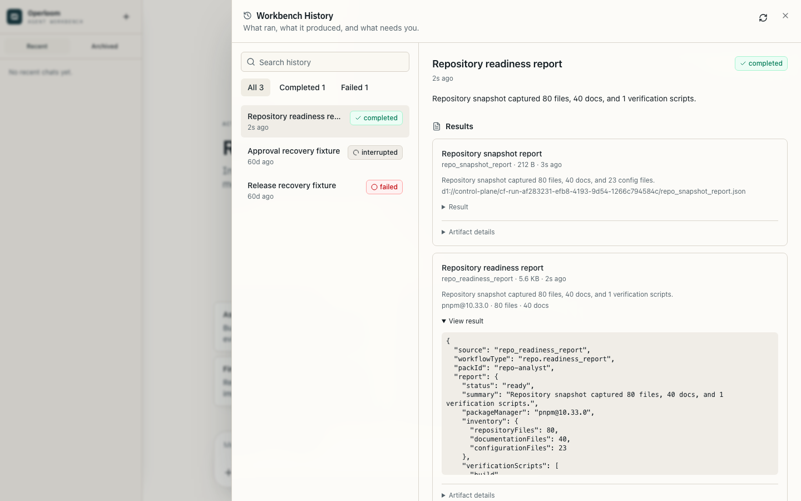
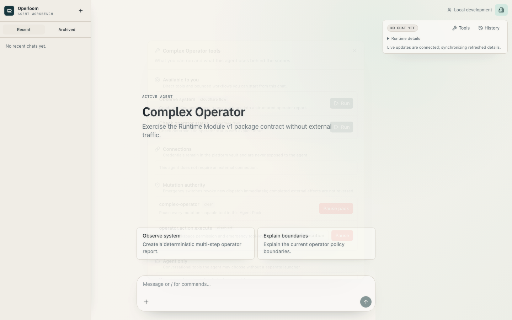
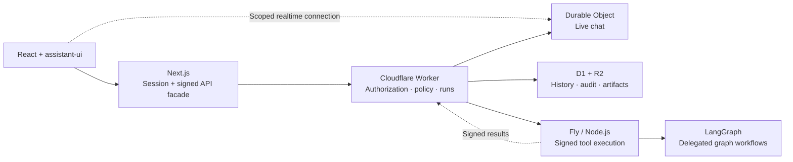

<div align="center">

# Operloom

**Your agents. Your workflows. Your code.**

A TypeScript workbench for agent systems you can inspect, extend, and own.

[](#status)
[](https://github.com/dawi369/operloom/actions/workflows/verify.yml)
[](#the-stack-and-the-decisions)
[](#license)

[Get started](#run-it-locally) · [Build an agent](docs/first-agent.md) · [Architecture](docs/architecture.md) · [Documentation](docs/README.md)

</div>


Define agents and tools in code. Give them a workspace, run their workflows,
review actions before they execute, and follow the result through history and
artifacts. Fork the whole application when your system needs to work differently.

## Why I built this

I wanted a home for my own agent systems: somewhere a useful experiment could
become a tool I actually trust. Chat is a good starting point. Once an agent can
run in the background or touch another system, I also want to know what it did,
which permissions it used, what failed, and how to recover.

Operloom is my answer to that problem. It brings the interface, execution
contracts, and operational controls together, while keeping the behavior in
ordinary TypeScript. It is also a deliberate record of how I approach software:
make ownership explicit, keep authority outside the model, and make failures
inspectable.

— [David](https://github.com/dawi369)

## What you can do

- **Work with agents in a real workspace.** Streaming chat, persistent threads,
  agent switching, and scoped access to tools and history.
- **Run work beyond a chat turn.** Durable workflows, cancellation, retry,
  scheduled/webhook triggers, and artifacts you can return to.
- **Keep control of side effects.** Server-enforced tool policy, approvals,
  credential brokerage, kill switches, and an action ledger with reconciliation.
- **Make it your own.** Typed agent packs contribute behavior, tools, workflows,
  managed state, and artifact renderers. The compiler connects them to the
  runtime; you do not edit a central switch statement for each agent.
- **Reuse the frontend boundary.** A framework-neutral client and React Query
  bindings support a different interface without duplicating the authorization
  and execution logic.

Start with **Operloom**, the general assistant for thinking, writing, debugging,
and planning. It works from the context you supply and needs no external tool
connections. **Repository Analyst** adds bounded repository inspection and a
readiness workflow. **Polymancer · Example** demonstrates read-only market
research; **Swordfish · Preview** is a parked architecture example with no live
backend. **Complex Operator** is a synthetic conformance fixture, excluded from
the normal catalog. Their domains stay out of the core UI.

<details>
<summary><strong>See execution history and tools</strong></summary>





Screenshots use an isolated local workspace with synthetic data.

</details>

## Run it locally

You need **Node.js 24 LTS**, **pnpm 10.33.0**, **ripgrep** for the repository
inspection example, and an **OpenRouter API key** for model responses. Node 26
is also supported for local development. Hosted accounts are not required for
the local workspace. Budget about 10 GiB of available RAM for the full local
stack and browser; [resource limits](docs/getting-started.md#local-resource-limits)
keep development and verification bounded.

```bash
git clone https://github.com/dawi369/operloom.git
cd operloom
pnpm install --frozen-lockfile
pnpm operloom init
```

Add `OPENROUTER_API_KEY` to both generated server-side files:
`.env.local` and `cloudflare/control-plane/.dev.vars`. Then:

```bash
pnpm operloom doctor --offline
pnpm operloom dev
```

Open **[localhost:3000](http://localhost:3000)**. The development command starts
the web app, local Cloudflare runtime, LangGraph, and signed runner together.
In another terminal, `pnpm operloom doctor` checks their reachability.

Initialization generates local transport secrets and applies forward database
migrations. It preserves configured credentials and existing development data.
The local identity fallback is explicit and unavailable in hosted deployments.

[Setup details and troubleshooting →](docs/getting-started.md)

## Build your first agent

```bash
pnpm operloom pack create --id my-agent --name "My Agent"
pnpm install
pnpm operloom pack compile
pnpm operloom pack check --pack my-agent
```

This generates a complete, deterministic read-only example and registers it in
`workbench.config.ts`. Edit its purpose and tools, then run the same check again.

| File in your pack       | What you own                                                           |
| ----------------------- | ---------------------------------------------------------------------- |
| `index.ts`              | Agent identity, declared capabilities, policy metadata, and welcome UI |
| `prompt.xml`            | The checked-in behavior prompt; keep the manifest prompt in sync       |
| `control-plane.ts`      | Typed tool bindings, workflows, and execution results                  |
| `runner.ts`             | Work that needs the Node.js runner                                     |
| `web.ts`                | Optional artifact and managed-state presentation                       |
| `control-plane.test.ts` | Executable checks for your behavior                                    |

Packs are **trusted code installed at build time**, not sandboxed third-party
plugins. A pack can declare a capability; it cannot grant itself credentials,
workspace access, or permission to execute a mutation.

[Walk through the example →](docs/first-agent.md) · [Full extension contract →](docs/agent-runtime-kit.md)

## The stack and the decisions

**Next.js 16 · React 19 · TypeScript · assistant-ui · Tailwind CSS 4 · Cloudflare
Agents / Workers / Durable Objects / D1 / R2 · LangGraph · WorkOS · OpenRouter ·
Sentry · Vitest · Playwright**



| Decision                                                        | Reason and tradeoff                                                                                                                                                                                                         |
| --------------------------------------------------------------- | --------------------------------------------------------------------------------------------------------------------------------------------------------------------------------------------------------------------------- |
| **Cloudflare owns application state and authority.**            | Chat, permissions, runs, and audit have an explicit owner. D1 stores control records; Durable Objects own live chat; R2 holds artifacts and exports. This couples the default deployment to Cloudflare.                     |
| **Next.js owns the web session and interface.**                 | WorkOS identity is resolved server-side; signed facades carry trusted scope to the Worker. The browser never grants itself a workspace, role, or credential. This adds a service boundary, but keeps secrets out of the UI. |
| **Use Node.js for tools that need it.**                         | A signed Fly runner provides the process environment for repository tools and heavier execution. Ordinary chat stays on Cloudflare. Fly can stop when idle; the tradeoff is a cold start.                                   |
| **Use LangGraph where graph orchestration is actually needed.** | Delegated graph runs use its orchestration primitives. A runner call alone is not represented as a LangGraph run. Normal chat does not take this detour.                                                                    |
| **Put policy outside the model.**                               | Tool visibility, execution modes, tenant scope, approvals, and reconciliation are application rules. Prompts explain behavior; they are not the security boundary.                                                          |
| **Compile agent packs.**                                        | Explicit contracts and generated registries make extensions inspectable and testable. Adding trusted code requires a build and deployment.                                                                                  |
| **Share a client, not a second backend.**                       | `@operloom/workbench-client` validates API responses; `@operloom/workbench-react` adds scoped caching and hooks. Alternate frontends reuse the same authority boundary.                                                     |

This is a multi-service application, not a single-process automation script.
That cost earns its place when you need an interface, persistent workspaces,
background execution, and controlled actions together. For a small scheduled
script, a smaller tool may be a better fit.

[Architecture and code seams →](docs/architecture.md) · [Decision records →](docs/README.md#decisions)

## Adapting and deploying

Change product identity without renaming the SDK packages:

```bash
pnpm operloom fork init --id my-system --name "My System" --origin https://agents.example.com
pnpm operloom fork --check
```

The default hosted topology is **Vercel + Cloudflare + Fly**, with **WorkOS**
for authentication and credential custody. Configure your own resource IDs,
origins, and secrets; the checked-in deployment manifests describe the original
installation and are not resources supplied to forks.

Deployment order is Cloudflare, Fly, then Vercel. Retained data, connections,
and external mutation are separately gated and default off. Scheduled triggers
also remain dormant until you deliberately enable the scheduler. Provider usage
and model calls have their own costs.

[Deployment guide →](docs/environment-separation.md) · [Forking and upgrades →](docs/forking.md)

## Quality and status

<a id="status"></a>

Operloom `0.5.1` is a **pre-1.0 developer workbench**. The web app and extension
contracts are the supported focus. A public production/SLO claim remains
subject to the hosted acceptance evidence in [Release Readiness](docs/release-readiness.md).

**Mobile is WIP / future work**, preserved on
[`codex/mobile-wip`](https://github.com/dawi369/operloom/tree/codex/mobile-wip).
The web installation does not pull in Expo or require native builds.

```bash
pnpm verify          # docs, contracts, unit tests, types, lint, audit, build
pnpm test:e2e        # isolated browser and service-boundary journeys
pnpm release:check   # extended conformance and Docker checks
```

The tests cover tenant boundaries, signed requests, durable chat delivery,
approval/recovery behavior, extension contracts, and data lifecycle. Browser
fixtures use isolated local state. Local checks do not substitute for a
signed-in hosted acceptance run.

[Release notes and compatibility →](docs/operloom-release.md) · [Contributing →](CONTRIBUTING.md) · [Security →](SECURITY.md)

## License

**Source-available under [PolyForm Noncommercial 1.0.0](LICENSE).**
Noncommercial use is permitted under its terms. Commercial use requires a
separate written agreement; see [Commercial Use](COMMERCIAL_USE.md).
This is not an OSI-approved open-source license.

Built on the assistant-ui LangGraph starter, with gratitude to the maintainers
of the tools that make this project possible.
